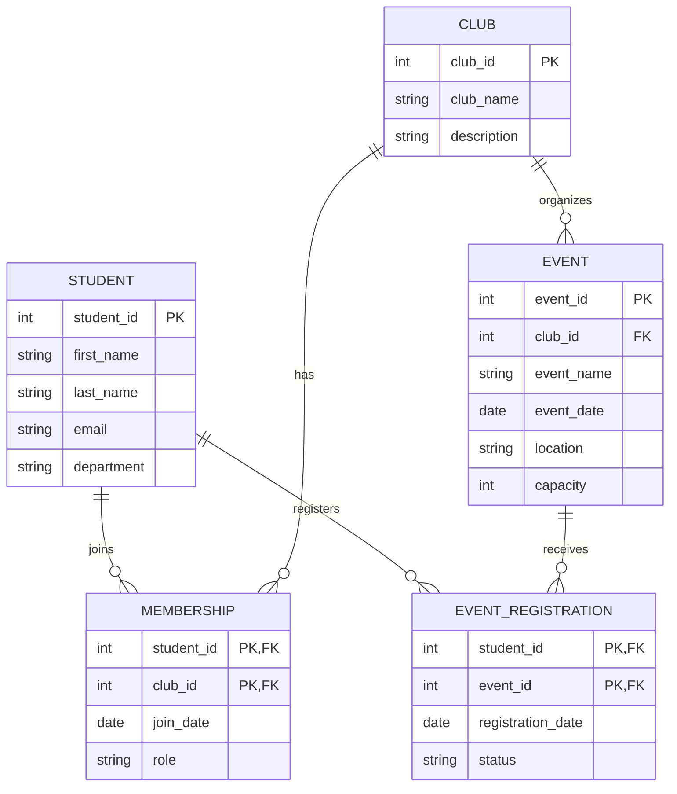

# Üniversite Kulüp Yönetim Sistemi - ER Diyagramı

```mermaid
erDiagram
    STUDENT {
        int student_id PK
        string first_name
        string last_name
        string email
        string department
    }

    CLUB {
        int club_id PK
        string club_name
        string description
    }

    MEMBERSHIP {
        int student_id PK, FK
        int club_id PK, FK
        date join_date
        string role
    }

    EVENT {
        int event_id PK
        int club_id FK
        string event_name
        date event_date
        string location
        int capacity
    }

    EVENT_REGISTRATION {
        int student_id PK, FK
        int event_id PK, FK
        date registration_date
        string status
    }

    STUDENT ||--o{ MEMBERSHIP : joins
    CLUB ||--o{ MEMBERSHIP : has
    CLUB ||--o{ EVENT : organizes
    STUDENT ||--o{ EVENT_REGISTRATION : registers
    EVENT ||--o{ EVENT_REGISTRATION : receives 
```